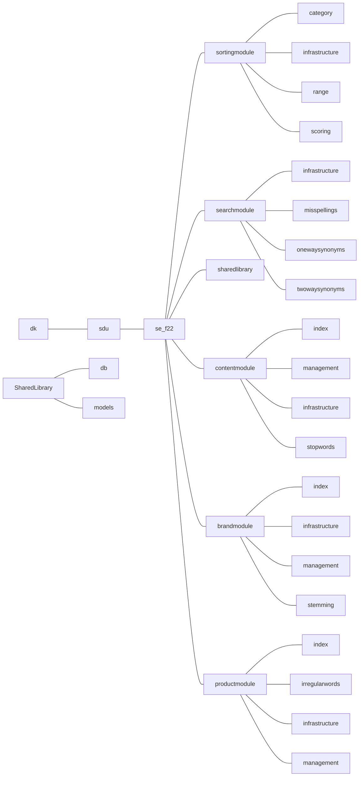

# SDU-SE-F22 - Hesehus Case

## Folder Structure

Each group should conform to the following folder structure, in order to minimize the amount of future merge errors. This folder structure should be used for the main java directory, as well as the test directory and the resources directory to ensure proper separation of modules.

The structure includes a main folder for each module, a folder for each submodule within the main folder, and a SharedLibrary folder for database connections etc.

