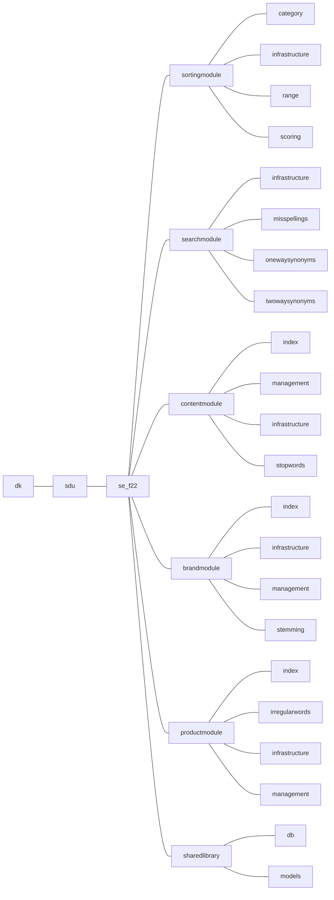

# SDU-SE-F22 - Hesehus Case [](https://github.com/LangeHenrik/SDU-SE-F22/actions/workflows/compile-test.yml)

## Folder Structure

Each group should conform to the following folder structure, in order to minimize the number of future merge errors. This folder structure should be used for the main java directory, as well as the test directory and the resources directory to ensure proper separation of modules.

The structure includes a main folder for each module, a folder for each submodule within the main folder, and a SharedLibrary folder for database connections, etc.



## Database

### Connect to databse

To connect to the database, please copy the `config.properties.example` to the file `config.properties` and add the needed credentials to access the database.

credentials:
- **db_url**: The URL for the database. For normal use, the last "db_name" is the only thing that should be edited, unless you have the database located remotely or on another port. Then follow this format: "jdbc:postgresql://\<address>:\<port>/\<database>"
- **db_user**: Username of the user, that you want to access the database as
- **db_password**: The password for the provided database user

***The `config.properties.example` is an example file, to show how the `config.properties` file should look. The data in these files, will not be committed to git***

### Migration

The system has a migration tool built-in, that can be used to keep the database up to date.

This migration system is located in [`dk\sdu\se_f22\sharedlibrary\db\DBMigration.java`](src/main/java/dk/sdu/se_f22/sharedlibrary/db/DBMigration.java).

The migration system has built-in command-line printing, and can be disabled by sending a `false` argument with the constructor:
```java
DBMigration migrator = new DBMigration(false);
```


#### What is a migration

A migration is a piece of SQL code, that is designed to move the database from one design to another.<br>
i.e Adding new tables, changing existing tables, or dropping tables.
This can also be used to seed the database.

For more information: 
- [What are database migrations? - Prisma](https://www.prisma.io/dataguide/types/relational/what-are-database-migrations)
- [What is Database Migration? - Aloowma](https://www.alooma.com/blog/what-is-database-migration)

Migration is used, so that you don't need to reinstall the database at every update, and this way persist data between updates.

#### Run migrations

To run the migration, the system needs to be connected to the database. Please see [Connect to databse](#connect-to-databse)

The migration itself can be run, by running the `.migrate()` method:
```java
DBMigration migrator = new DBMigration();
migrator.migrate();
```

The system allows for the database to be freshly migrated.<br>
***THIS WILL CLEAR ALL OF THE DATA FROM THE DATABASE PUBLIC SCHEMA***<br>
*Use with caution*
```java
DBMigration migrator = new DBMigration();
migrator.migrateFresh();
```

It is not possible to roll back any migrations, but if a migration fails, the system will halt and automatically roll back to the last stable migration.

The current system is only one-way migration, and no rollback function is available. **If a migration has been run, it cannot be rolled back.**

#### How to write a migration

The migrations, are located in the folder `src\main\resources\dk\sdu\se_f22\sharedlibrary\db\migrations`.

All files, that end in .sql will be run as if it was a migration.<br>
The system automatically keeps track of which files have been run.<br>
**Please note, when changing the names of a migration file, the system will treat this as a new migration.**

The files may be named as follows (naming is only used for sorting - Very important for the order the migrations should be done in):<br>
\<version>.\<minor_version>_\<descriptive name>.sql

Take a look at the existing migrations, to see examples, of how they are built.

The system also has a batch tracker, so that you can look up, in which batch, which migrations were run.

#### Tl;dr
This makes it possible to update the database. The only thing you have to do, is write a new .sql file in `src\main\resources\dk\sdu\se_f22\sharedlibrary\db\migrations` that contains the sql code necessary to update the database to the new desired state. As well as run the migration code.


## Github actions
We have implemented, some automated checks, called GitHub Actions or Workflows, that automaticly tests the whole project.  

We have two different tests:
- Java compile test
  - This only checks, if the whole codebase can be compiled, and ensure that groups are warned if they have a pull-request or push to main, that contains errors that result in an error while compiling
  - Command runned: `mvn compile`
- Java system test
  - This will run all integration- and unit-tests, as well as test all the migrations.
  - Command runned: `mvn verify`

A failed check cannot block any merges or pushes. Therefore these automated checks can only be viewed as a pointer to see, if your code is up to par.  
The checks are visible when creating a pull request on GitHub, just abode the merge button. A green checkmark can be seen when a pull request or a push has passed all checks, and a red x can be seen when one or more checks has failed.

All of this, is beyond the current pensum for 2. semester.  
The GitHub actions can be found in the `.github\workflows` folder.
