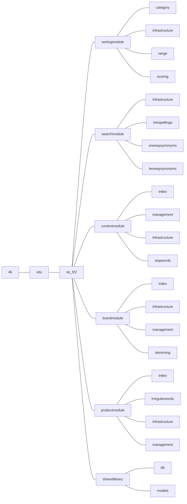

# SDU-SE-F22 - Hesehus Case [](https://github.com/LangeHenrik/SDU-SE-F22/actions/workflows/compile-test.yml)

## Folder Structure

Each group should conform to the following folder structure, in order to minimize the amount of future merge errors. This folder structure should be used for the main java directory, as well as the test directory and the resources directory to ensure proper separation of modules.

The structure includes a main folder for each module, a folder for each submodule within the main folder, and a SharedLibrary folder for database connections etc.



## Database

### Connect to databse

To connect to the databse, please copy the `config.properties.example` to the file `config.properties` and add the needed credentials to access the database.

credentials:
- **db_url**: The url for the database. For normal use, the last "db_name" is the only thing that should be edited, unless you have the database located remotely or on another port. Then follow this format: "jdbc:postgresql://\<address>:\<port>/\<database>"
- **db_user**: Username of the user, that you want to access the database as
- **db_password**: The password for the provided database user

***The `config.properties.example` is an example file, to show how the `config.properties` file should look. The data in these files, will not be commited to git***

### Migration

The system, has a migration tool build in, that can be used to keep the database up to date.

This migration system is location in `dk\sdu\se_f22\sharedlibrary\db\DBMigration.java`

The migration system, has build-in command line printing, and can be disabled by sending a `false` argument with the constructor:
```java
DBMigration databaseSeeder = new DBMigration(false);
```


#### What is a migration

A migration, is a piece of sql code, that is designed to move the database from one design to another.<br>
Ie. Adding new tables, changing existing tables or dropping tables.
This can also be used to seed the database.

For more information: 
- [What are database migrations? - Prisma](https://www.prisma.io/dataguide/types/relational/what-are-database-migrations)
- [What is Database Migration? - Aloowma](https://www.alooma.com/blog/what-is-database-migration)

#### Run migrations

To run the migration, the system needs to be connected to the databse. Please see [Connect to databse](Connect-to-database)

The migration itself, can be runned, by runnning the `.migrate()` method:
```java
DBMigration databaseSeeder = new DBMigration();
databaseSeeder.migrate();
```

The system allows for the database to be freshly migrated.<br>
***THIS WILL CLEAR ALL OF THE DATA FROM THE DATABASE PUBLIC SCHEMA***<br>
*Use with caution*
```java
DBMigration databaseSeeder = new DBMigration();
databaseSeeder.migrateFresh();
```

It is not possible to rollback any migrations, but if a migration fails, the system will hald, and automaticly rollback to the last stable migration.

The current system, is only one way migration, and no rollback function is available. **If a migration has been run, it cannot be rolledback.**

#### How to write a migration

The migrations, is located in the folder `src\main\resources\dk\sdu\se_f22\sharedlibrary\db\migrations`.

All files, that end in .sql will be runned, as if it was a migration.<br>
The system automaticly keeps track of which files has been runned.<br>
**Please note, when changing the names of a migration file, the system will treat this as a new migration.**

Take a look int the existing migrations, to see examples, of how they are build.

The system also has a batch tracker, so that you can look up, in which batch, which migrations was runned.